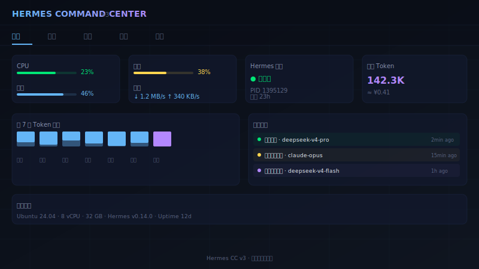
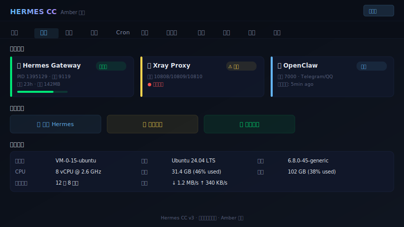

# Hermes Command Center (CC) v3 🦞

> 综合监控操作台 — Hermes Monitor + 控制面板 + ClawMetry 追踪 + 自动修复 + 一键操作




## ✨ 功能一览

| 功能 | 说明 |
|------|------|
| 📊 **系统监控** | CPU/内存/磁盘/网络实时状态 |
| 🤖 **Hermes 会话** | 追踪会话、Token 消耗、调用次数 |
| 💰 **费用分析** | 按天/周/月统计模型调用费用 |
| 🔑 **API 余额** | DeepSeek 等 API 余额一键查询 |
| 📋 **日志查看** | 实时日志流式查看 |
| 🩺 **服务自检** | 服务健康检查 + 自动修复 |
| 🔄 **模型切换** | 一键切换 Hermes 模型 |
| 🎨 **深色主题** | 暗色玻璃拟态 UI，护眼又高级 |

## 🚀 快速开始

```bash
# 1. 克隆
git clone https://github.com/JINGZHE0635/Hermes-CC-v3.git
cd Hermes-CC-v3

# 2. 安装依赖
pip install -r requirements.txt

# 3. 启动（默认端口 6789）
MONITOR_PASSWORD=your-password python3 hermes-cc.py
```

打开浏览器访问 **http://localhost:6789** 即可。

## ⚙️ 环境变量

| 变量 | 默认值 | 说明 |
|------|--------|------|
| `MONITOR_USERNAME` | `admin` | 登录用户名 |
| `MONITOR_PASSWORD` | `change-me` | 登录密码 |
| `PORT` | `6789` | 监听端口 |

## 🏗️ 技术栈

- **框架:** FastAPI + Uvicorn
- **前端:** 原生 HTML/CSS/JS（无框架，单文件）
- **加密:** Cryptography (Fernet)
- **存储:** SQLite（本地会话追踪）

## 📁 项目结构

```
Hermes-CC-v3/
├── hermes-cc.py          # 主程序（单文件，139KB）
├── hermes-cc-preview.svg # 界面预览图 - 总览
├── hermes-cc-preview-2.svg # 界面预览图 - 服务
├── requirements.txt      # Python 依赖
└── README.md             # 本文件
```

## 📜 许可证

MIT
